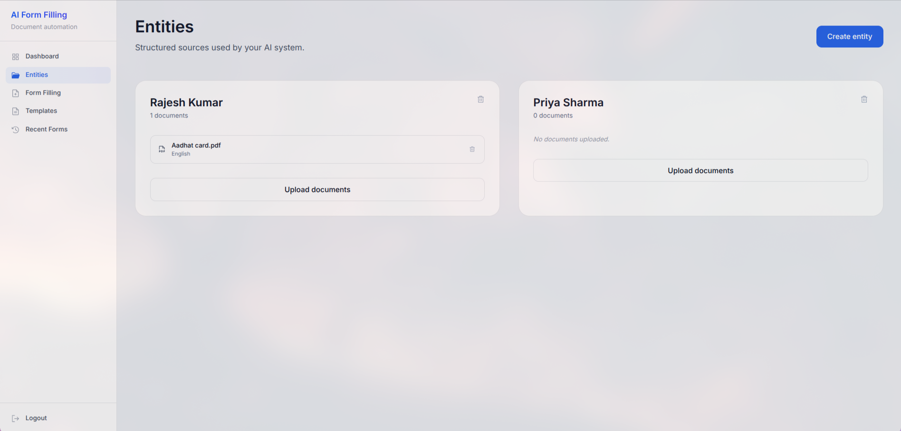
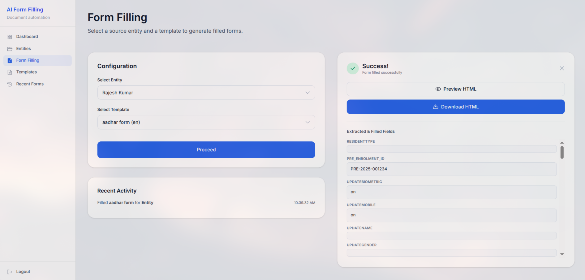
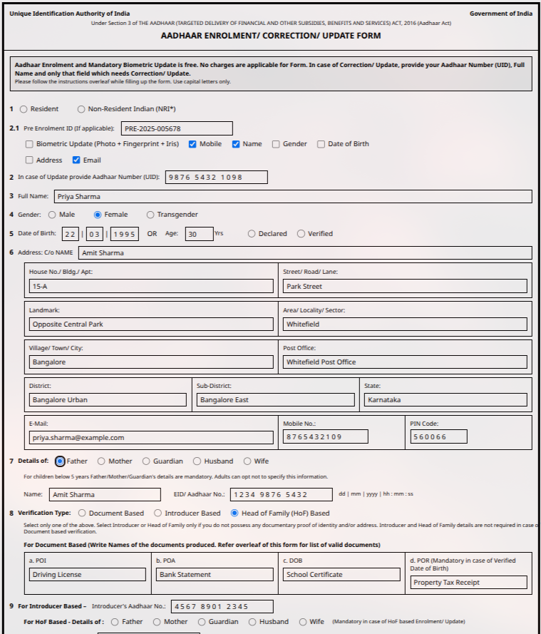

<h1 align="center">AI-Powered Form Filling Assistant for Indian Citizen Services</h1>

An intelligent form-filling solution designed to help citizens at Seva Kendras auto-fill government service forms using their uploaded documents, reducing manual effort and errors.

---

## 📋 Problem Statement

Citizens often need to fill multiple government service forms at Seva Kendras for certificates, licenses, and welfare schemes. This involves repetitive data entry from identity documents like Aadhaar, PAN, Voter ID, etc. Our solution automates this process using AI-powered document extraction and intelligent form mapping.

---

## 💡 Our Solution

A web-based application that enables users to:

1. **Sign Up & Login** - Secure user authentication
2. **Create Entities** - Create multiple entities (individuals/beneficiaries)
3. **Upload Documents** - Upload identity documents (Aadhaar, PAN, Voter ID, etc.)
4. **Extract Information** - AI-powered OCR extracts key details automatically
5. **Select Template** - Choose from available HTML form templates
6. **Auto-Fill Forms** - AI maps extracted data to form fields
7. **Review & Download** - Preview, edit if needed, and download the filled form

---

## 🔄 Application Flow

\`\`\`
User Sign Up → Create Entity → Upload Documents → Select Template → Auto-Fill Form → Review & Download
\`\`\`

---

## 📸 Screenshots

### Entity Management

Users can create and manage multiple entities, each representing an individual whose documents are uploaded.

### Form Filling

Select an entity and a form template to automatically populate the form with extracted data.

### Filled Form Preview

Review the auto-filled form before downloading.

---

## ✨ Key Features

| Feature                            | Description                                                        |
| ---------------------------------- | ------------------------------------------------------------------ |
| 📄**Document Upload**        | Upload PDFs and images of identity documents                       |
| 🤖**AI-Powered Extraction**  | Automatically extract key details (name, DOB, address, ID numbers) |
| 🎯**Smart Form Mapping**     | AI agent intelligently maps extracted data to form fields          |
| 📝**HTML Form Templates**    | Support for HTML-based government form templates                   |
| 🌐**Multi-Language Support** | Support for 80+ languages including Indian regional languages      |
| ✅**User Review**            | Preview and edit before final submission                           |

---

## 🏗️ Architecture Overview

\`\`\`
Document Upload → OCR Processing → Entity Extraction → AI Form Mapping → Filled Form Output
\`\`\`

---

## 📦 Project Structure

\`\`\`
├── backend/          # FastAPI backend with AI agents
│   ├── api/          # REST API endpoints
│   ├── ai_agents/    # AI agent for form mapping
│   ├── ocr/          # OCR microservice
│   └── scripts/      # Automation scripts
├── frontend/         # React-based web interface
└── snapshots/        # Application screenshots
\`\`\`

---

## 🚀 Quick Start

\`\`\`bash

# Backend

cd backend
uv sync
./scripts/run_server.sh

# Frontend

cd frontend
npm install
npm run dev
\`\`\`

---

## 🤝 Contributors

<table>
   <tr>
      <td align="center">
         <a href="https://github.com/SaiDhinakar">
             
            <b>SaiDhinakar</b>
         </a>
      </td>
      <td align="center">
         <a href="https://github.com/Pradeesh1108">
             
            <b>Pradeesh1108</b>
         </a>
      </td>
      <td align="center">
         <a href="https://github.com/RUBA-SHREE">
             
            <b>RUBA-SHREE</b>
         </a>
      </td>
   </tr>
</table>
