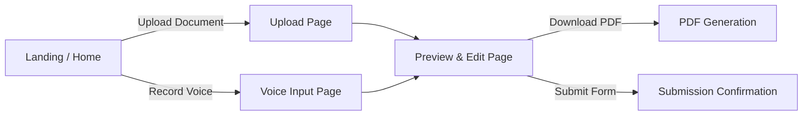

# Frontend Flow (React + Tailwind)

## Block Diagram



---

### 1. Landing / Home Page

**Components:**
- Header (logo, navigation)
- CTA buttons: `Upload Document` | `Record Voice` | `Login/Profile`

**Flow:**
- Clicking `Upload Document` → navigates to **Upload Page**
- Clicking `Record Voice` → navigates to **Voice Input Page**

**Tech Notes:**
- Responsive layout using Tailwind
- Use React Router for navigation

---

### 2. Upload Document Page

**Components:**
- File upload input (PDF / Images)
- Drag-and-drop area
- Supported file type hints
- `Submit` button
- Progress bar / loader while backend processes

**Flow:**
1. User drags/drops or selects file → file preview appears
2. Click `Submit` → send file to backend API (`/upload-doc`)
3. Show loader until backend returns extracted data & form mapping
4. On success → navigate to **Preview & Edit Page** with filled form data

**Tech Notes:**
- Use `react-dropzone` for drag-and-drop
- Axios or Fetch for API calls
- Loader component for latency (3–5s processing)

---

### 3. Voice Input Page

**Components:**
- Microphone button (`Start/Stop Recording`)
- Audio waveform / timer display
- Real-time text display as speech is recognized (optional)
- `Submit` button
- Loader / progress bar

**Flow:**
1. User clicks `Start` → browser microphone access requested
2. Capture audio → send to backend API (`/upload-voice`)
3. Backend returns transcribed text → display for user confirmation
4. Proceed to **Preview & Edit Page** with extracted entities mapped

**Tech Notes:**
- Use Web Audio API + MediaRecorder
- Optionally integrate WebSocket for real-time transcription
- Show confidence score visually (e.g., low confidence highlighted)

---

### 4. Preview & Edit Page

**Components:**
- Form fields pre-filled from extracted data (Name, DOB, Address, ID numbers)
- Inline editable inputs for correction
- Confidence indicators per field (color-coded)
- `Save Changes` button → updates local state
- `Download PDF` / `Submit Form` buttons

**Flow:**
1. Display extracted fields in editable form
2. Users can correct wrong values
3. On `Download PDF` → call backend `/generate-form` API → download filled PDF
4. On `Submit Form` → call backend `/submit-form` API → show success message / redirect

**Tech Notes:**
- Use controlled inputs in React
- Map JSON schema fields dynamically
- Use `react-hook-form` for validation and handling large forms
- Add real-time validation (e.g., Aadhaar format, date format)

---

### 5. Download / Submission Flow

**Components:**
- Download button triggers backend PDF generation
- Submission button triggers API call and shows status

**Flow:**
1. User clicks `Download` → receive PDF file
2. User clicks `Submit` → backend processes submission
3. Show toast or modal with submission success / failure

---

### 6. Notifications & Feedback

- Use toast notifications (e.g., `react-toastify`) for:
	- File upload success / failure
	- Voice recognition success / errors
	- Form submission status
- Loader for backend processing steps

---

### 7. Optional Enhancements

- **History Page:** Show previously uploaded/filled forms
- **Multilingual UI:** Switch language for labels and messages
- **Dark Mode:** Tailwind theme toggler

---

## Summary of Data Flow (Frontend Perspective)

```
Upload Document / Voice Input 
		→ Send to backend API (/upload-doc or /upload-voice)
		→ Receive extracted entities / pre-filled form
		→ Preview & Edit Page (user corrects if needed)
		→ Submit → backend generates PDF / submits form
		→ Download / Confirmation
```
